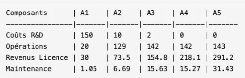

# Project-management

## **Chapitre 1**

### Démarrer un projet informatique

### 1.1 Démarrer un projet informatique

---

### *1.1.1 Identifier les enjeux :*

Définir quels sont les critères de réussites et les hierarchiser

2 à 4 enjeux majeurs ( Recommandé )

( Exemples d'enjeux : *Positions dans un marché, Satisfaction client* )

---

### *1.1.2 Définir les objectifs du projet :*

Que veut-on obtenir ? A quel besoin le projet répond ?

---

### *1.1.3 Le périmètre du projet :*

Portée & Limite du projet

Lister les objectifs détaillés, le budget, les ressources ( humaines / matériels / ... ), etc

Les limites, les frontière, où va s'arrêter le projet, la date butoire.

Cloud et IA difficile de poser des limites financières.

Niveau de qualité

QCD (Qualité Coup Délai)

---

### 1.2 Élaborer son projet

---

### *1.2.1 Dimensionner le projet*

Prévoir quelles ressources seront affectées sur quelles durées et sur quelles tâches

Ressources matériels (Serveurs, Ordinateur, Licenses)

Listing des ressources

Base pour la construction du budget

Echelle temporelle : Délai global du projet ( Unité jour Recommandé )

SaaS ( Software as a service )

Optimiser le temps & les ressources

Planning

---

### *1.2.2 Constituer une équipe*

Compétences des personnes dans l'équipe

Taille de l'équipe

Manier les compétences et les personnes agilement pour mener à bien le projet

Organigramme

CV

Chef de projet ( Role : Coordinateur, communication dans l'équipe, gestion du temps )

---

### *1.2.3 Déclencher le projet*

Démarrage de projet

Toutes les précédentes informations requisent pour lancer le projet.

---

### 1.3 L'apport de la conduite de projets

---

### *1.3.1 Maximiser la Valeur du projet*

---

### *1.3.2 Fiabiliser l'emploi des ressources et le planning*

Gestion & économiser un maximum les ressources tout en atteignant la finalité du projet

---

### *1.3.3 Développer son équipe*

---

### 1.4 Quatre projets sous forme d'études de cas

---

## **Chapitre 2**

### Les aspects financiers & juridiques

---

Salaire = Charge la plus importante de l'IT

Lister les ressources ( Temps et prix alloués à chaque ressource )

---

### 2.1 Les aspects financiers

Prix des coûts

Liste les ressources, leur temps et leur coût ( Grille de coût )

Estimation globale du coût du projet

---

### *2.1.1 La structure de coût d'un projet*

Réalisation (≈75% première année) :

- Salaire internes (+65% charges)
- Prestations SSII (markup ~60%)
- Var : Compétences, expérience, modalités

---

### *2.1.2 Les prestations d'hébergement*

Régie :

- Factu Mensuelle
- Paiement échelonné 
- 30-60j de paiement

Forfait :

- Paiement échelonné
- 10/30% à la commande
- 20-30% à la recette

---

### *2.1.3 Le plan de charge financier*

Hébergement :

- Solutions virtualisées
- Cloud computing
- Tarification selon usage

Maintenance :

- Gestion utilisateurs
- Supervision systèmes
- Sauvegardes restaurations

---

### *2.1.4 Les prestations d'exploitation et de maintenance*

Support Utilisateur :

- Niveau 1, 2, 3
- SLA définis
- Facturation selon volume

Coûts Additionnels :

- Formation
- Marketing
- Documentation
- Frais commerciaux

Points Clés :

- Budget initial critique
- Gestion des risques
- Flexibilité infrastructure
- Optimisation trésorerie

---

### *2.1.5 Les prestations de support aux utilisateurs*

- Niveau 1, 2, 3
- SLA définis
- Facturation selon volume

---

### *2.1.6 Les coûts refacturés*

- Formation
- Matériel

---

### *2.1.7 Les coûts non liés à l'informatique*

- Marketing
- Documentation
- Frais commerciaux

---

### 2.2 Les budgets

---

### *2.2.1 Constitution des budgets*

- Pay as you go
    - Facturation à l'usage
    - Modèle transactionnel

Structure Financière (sur 5 ans) :

Exemple :

Indicateurs Clés :

- VAN (VPN)
    - Valeur Actuelle Nette
    - Compare au WACC
- TRI (IRR)
    - Taux Rentabilité Interne
    - Rapidité retour investissement
- Break Even
    - Point d'équilibre P&L
    - Seuil rentabilité cash-flow

Analyse Performance

- Cash-flow cumulatif
- Profit cumulatif
- Période remboursement
- Amortissement R&D
- WACC référence (~15%)

---

### *2.2.2 Les indicateurs liés aux budgets*

Points Critiques :

- Pourcentage de l'utilisation du budget
- Suivi du rythme des dépenses 

--- 

### 2.3 Le compte de résultats

- ?

---

### 2.4 Le business care

- ?

---

### 2.5 Le suivi financier des projets

- ?

---

### *2.5.1 Les comptes rendus d'activité*

Rôle et Importance

- Instruments de mesure essentiels pour :
    - ?
    - Suivi du budget de réalisation

---

### *2.5.2 La reconnaissance du chiffre*

**Principe**

- Modèle comptable spécifique pour les entreprises de R&D
- Lissage du chiffre d'affaires selon le rythme des investissements

**Rôle du Chef de Projet**

- Décompte des activités de développement
- Évaluation de l'apport de valeur au produit
- Impact direct sur la reconnaissance du revenu

**Points Clés à Retenir**

- Importance de la documentation précise des activités
- Double impact sur :
    - Le suivi opérationnel
    - La reconnaissance financière

---

### 2.6 La réglementation concernant la protection des données personnelles (date privacy)

---

### *2.6.1 Que recouvre le terme de données personnelles ?*

#### 1. Principe Fondamentaux

---

- App du RGPD depuis 2018 dans l'UE
- Propriété des données par les individus
- Responsabilisation des organisations

**Acteurs Clés :**

- Data Subject (Individus)
- Data Controller (Organismes de contrôle)
- Data Processor (Sous-traitants)

#### 2. Droits et Obligations

---

**Droits des Individus :**

- Consultation des données
- Rectification
- Suppression
- Information en cas de violation

#### 3. Données Personnelles
---

**Définition :**

- Identifiants directs :
    - Nom
    - Adresse
    - Email
    - Numéros (téléphone, contrat)
- Idenntifiants indirects
- Attributs personnels (santé, religion, etc.)

#### 4. Gestion des données
---

**Conservation :**

- Durée limitée au traitement
- Effacement après utilisation
- Cas spéciaux (compatibilité, etc.)

**Sécurisation :**

#### 5. Registre des Traitements
---

Éléments à Documenter

- Identification du traitement
- Objectif
- Liste des données
- Durée
- Sous-traitance
- Territorialisation
- Sécurité
- Conservation
- Sauvegarde
- Neutralisation

#### 6. Territoialisation
---

**Contrainte :**

- Hébergement territorial
- Protection des transferts
- Sécurisation du développement
- Gestion du Cloud

#### 7. Chief Digital Officer (CDO)
---

**Responsabilités :**

- Pilotage des activités données
- Gestion des incidents
- Formation des équipes
- Coordination des projets
- Conformité réglementaire

---

**Points Clés**

*La responsabilité pénale des dirigeants peut être engagée en cas de défaillance.*

---

### *2.6.2 Des données personnelles conserves le temps d'effectuer des traitements*

### *2.6.3 Le stockage des données personnelles et leur neutralisation*

### *2.6.4 Le register des traitements*

### *2.6.5 La territorialisation des données dans le cadre d'un projet de développement*

### *2.6.6 La responsabilité des données au sein des organisations (alias CDO)*

---

### 2.7 Le cadre contractuel du projet

### 2.8 Étude financière du site de vente en ligne

## Chapitre 3 La prise en compte du risque

### 3.1 Les trois axes

**Introduction :**

- La complexité de la gestion de projet : par où commencer ?
- Un cadre structuré pour s'organiser
- Une approche tirdimensionnelle

---

**Les Trois Dimensions Clés :**

- Axe du Temps (Cycle de vie)
- Axe d'Analyse (Niveau d'abstraction)
- Axe de Pilotage (Cycle de décision)

**Axe du Temps (Développement)**

- Expression des besoins
- Phases de développement
- Livraison
- Maintenance
- Sans cet axe :
    - Non-conformité aux besoins
    - Dérive du projet
    - Tests insuffisants

**Axe d'Analyse ()**

**Axe de Pilotage (Décision)**

### 3.2 Le modèle de développement

Un choix stratégique pour le chef de projet

---

**Introduction**

- Premier choix crucial du chef de projet
- Impact sur l'organisation temporelle
- Pas de modèle universel : tout dépend du contexte
- Six principaux modèles à considérer

---

### *3.2.1 Le modèle Cascade*

**Structure :**

- Progression linéaire
- Chaque étape suit la précédente
- Pas de retour en arrière facile

**Étape clés :**

1. Idée - démarrage
2. Expression des besoins
3. Spécifications
4. Développement
5. Tests unitaires
6. Tests d'intégration
7. Tests fonctionnels
8. Installation

**Point d'attention :**

- Coût exponentiel des modifications tardives
- "Effet cascade" : difficile de remonter le courant

---

### *3.2.2 Le modèle en V*

**Caractéristiques :**

- Évolution du modèle cascade
- Anticipation des tests
- Symétrie entre conception et validation

**Avantages :**

- Tests sous-traités et objectifs
- Vérification précoce de la couverture fonctionnelle
- Limitation des erreurs de conception

**Incovénient :**

- Durée augmentée de 30-40%

---

### *3.2.3 Le modèle itératif*

**Principes :**

- Succession de mini-cascades
- Focus sur les risques techniques
- Évolution constante des périmétres

**Organisation :**

- Début par les parties complexes
- Phases de stabilisation
- ?

---

### *3.2.4 Le modèle RAD*

**Caractéristiques :**

- Explo fonctionnelle
- Maquettage graphique important
- Forte implication client

**Conditions de réussie :**

- Techno robustes & mature
- Outils de dév de haut niveau
- Plateforme standard

**Usage :**

- Privilégié par les SSII
- Adapté aux prototypes (POC)

---

- **3.2.5 Le modèle Extreme Programming**

**Spécificités :**

- Cycles courts
- Binôme junior/senior
- Tests précoces
- Intégration continue

**Points forts :**

- Livraisons fréquentes
- Transmission de compétences
- Feedback cliebt régulier
- Tests automatisés

---

### *3.2.6 Le modèle RUP (Rational Unified Process)*

**Caractéristiques :**

- Basé sur UML
- Intègre la gestion de projet
- Niveau conceptuel élevé

**Variantes :**

- RUP
- XUP
- 2TUP

**Conclusion :**

- Choix selon les caractéristiques du projet
-  Impact sur l'organisation & le résultat
- Importance de l'adéquation avec :
    - L'équipe
    - Les techno
    - Les contraintes du projet
    - Les attentes client

### 3.3 Le modèle d'analyse

Principes & Méthodes de Modélisation

---

**Introduction**

- Étude du système en devenir
- Importance de définir les contours du système
- Focus sur les stimuli utilisateurs
- Défi : modéliser ce qui n'existe pas encore

---

### *3.3.1. Le Principe de Modélisation*

**Définition :**

- Abstraction de la réalité
- Description formalisée du système cible
- Outil de définition des priorités

**Les 3 Étapes Clés :**

1. Abstraction
    - Analyse de l'existant
    - Extraction de l'essentiel
    - Évitement des biais

2. Instanciation
    - Création d'instances concrètes
    - Transformation en code
    - Application du modèle

3. Vérification
    - Confrontation avec la réalité
    - Validation des règles sémantiques
    - Ajustements nécessaires

---

### *3.3.2 Le modèle Merise*

?

---

### *3.3.3 Le modèle UML*

?

---

**Conclusion :**

- Importance de la modélisation appropriée
- Adaptation selon le contexte
- Complémentarité des approches
- Nécessité de vérification continue

---

### 3.4 Le modèle de pilotage

Gouverner c'est prévoir

**Introduction :**

- Vision systémique du projet
- Contrôle externe du processus
- Intégration dans les flux de l'entreprise
- Anticipation des aléas

---

### *3.4.1 Les faits relatifs au projet*

**Le Comité de Pilotage :**

**Composition :**

- Chef de projet
- Représentants du comité de direction
- Partenaires
- Clients

**Rôle :**

-
-
-

---

**Les Sources d'Information**

1. Canaux Formels

- États d'anomalies (bug tracking)
- États de charge des équipes
- Remontées utilisateurs
- Planning

2. Canaux Informels

- Réunions de suivi
- Échanges d'expérience
- Clubs utilisateurs

---

### *3.4.2 Les indicateurs clés de performance (PKI)*

Les Indicateurs Clés (KPI)

1. Planning

- Écarts prévisionnel/réalisé
- Chemin critique
- Niveau de charge équipe

2. Qualité

- Nombre d'anomalies
- Temps de traitement
- Balance âgée

3. Roadmap

- Périmètre fonctionnel
- Respect architectures
- Jalons clés

4. Finances

- Business case
- Budget
- Investissements

5. Équipe

- Niveau sous-traitance
-
-

6.

-
-
-

---

### *3.4.3 Le pilotage du projet*

**Conclusion :**

-
-
-
-

### 3.5 Prendre en compte le risque

### *3.5.1 L'analyse des risques*

### *3.5.2 Le plan de risques*

### 3.6 Étude du risque pour le projet de CRM

## Chapitre 4 ?

### 4.1 ?

### 4.2 Les phases du projet

---

### *4.2.1 L'expression de besoins et le cahier des charges*

Contenu du Cahier des Charges

- Contexte & objectifs stratégique
- Objet et périmètre du projet
- Domaine métier
- Périmètre fonctionnel
- Critères de qualité
- Conditions opérationnelles
- Méthodologie
- Planning et aspects financiers
- Responsabilités et garanties

---

### *4.2.2 Le cadrage et les spécifications générales*

Dossier d'Intégration Fonctionnelle (DIF)

- Acteurs
- Étapes des processus
- Conditions de déclenchement
- Résultats attendus

Dossier d'Intégration Technique (DIT)

- Architecture applicative
- Interfaces techniques
- Procédures d'exploitation
- 

---

### *4.2.3 La conception détaillée*

- L'objectif de ce document est de fournir la feuille de route exhaustive et détaillée nécessaire à la réalisation technique de votre projet

---

### *4.2.4 La réalisation*

Réalisation = Développement du projet

---

### *4.2.5 Les tests et les corrections, l'assurance qualité*

- ?

---

### *4.2.6 Les types de tests*

- Test unitaire
    - Validation des modules individuels
    - Tests automatisés
    - Frameworks

- Tests d'intégration
    - Connectivité
    - Sécurité
    - Performance
    - Installation
    - Environnement

- Tests fonctionnels
- Tests de bout en bout
- Tests d'acceptation
- Tests de performance
- ...

---

### *4.2.7 Gestion des versions*

Chaque grande nouveauté dans le projet et une nouvelle version

Production des Versions

- Numérotation (Majeure.Mineur)
- Release notes
- Change log
- Procédures d'installation

Livraison Continue

- Intégration continue
- Déploiement automatisé
- Tests fréquents

**Mot clé :**

CICD : Continuous Integration and Continuous Delivery/Deployment 

---

### *4.2.8 Le lancement*

Mise en production du projet

---

*By Maxime.S*