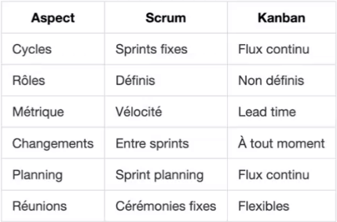

# Project-management

## Chapitre 1 : Démarrer un projet informatique

### 1.1 Démarrer un projet informatique

#### 1.1.1 Identifier les enjeux
- Définir les critères de réussite et les hiérarchiser.
- Recommandé : 2 à 4 enjeux majeurs (ex. : positionnement marché, satisfaction client).

#### 1.1.2 Définir les objectifs du projet
- Quelles sont les attentes ? Quel besoin est adressé ?

#### 1.1.3 Définir le périmètre du projet
- Détails : objectifs, budget, ressources (humaines, matérielles).
- Limites : frontières du projet, deadline.
- Critères QCD (Qualité, Coût, Délai).

### 1.2 Élaborer le projet

#### 1.2.1 Dimensionner le projet
- Allocation des ressources (serveurs, licences, etc.).
- Planification en jours, budget de base.

#### 1.2.2 Constituer une équipe
- Compétences, taille et organigramme de l'équipe.
- Rôle du chef de projet : coordination, gestion du temps.

#### 1.2.3 Déclencher le projet
- Rassemblement des informations pour le lancement.

### 1.3 Apport de la conduite de projets

#### 1.3.1 Maximiser la valeur du projet

#### 1.3.2 Fiabiliser l'emploi des ressources et le planning
- Gestion des ressources pour atteindre les objectifs.

#### 1.3.3 Développer l'équipe

### 1.4 Études de cas : Quatre projets

## Chapitre 2 : Aspects financiers & juridiques

### 2.1 Les aspects financiers

#### 2.1.1 Structure de coût
- Salaire, prestations SSII, et charges diverses.

#### 2.1.2 Prestations d'hébergement
- Régie (facturation mensuelle) et forfait (paiement échelonné).

#### 2.1.3 Plan de charge financier
- Hébergement virtualisé, cloud computing, tarification usage.

#### 2.1.4 Prestations d'exploitation et maintenance
- Support utilisateur (Niveau 1, 2, 3), coûts additionnels (formation, documentation).

### 2.2 Les budgets

#### 2.2.1 Constitution des budgets
- Modèle "pay as you go", indicateurs : VAN, TRI, seuil rentabilité, cash-flow.

### 2.3 - 2.6 : Comptes, business case, suivi financier, et RGPD
- RGPD : droits des individus, conservation, territorialisation des données.

## Chapitre 3 : Prise en compte du risque

### 3.1 Les trois axes
- Dimensions : temps (cycle de vie), analyse (abstraction), pilotage (décision).

### 3.2 Modèles de développement
- Modèles : Cascade, en V, itératif, RAD, Extreme Programming, RUP.

### 3.3 Modèles d'analyse (Merise et UML)

### 3.4 Modèle de pilotage
- Importance de la gouvernance et des indicateurs (planning, qualité, finances, équipe).

### 3.5 Prise en compte du risque
- Analyse et plan de risque pour CRM.

## Chapitre 4 : Phases du projet

### 4.2 Phases principales
- Cahier des charges, spécifications, conception, réalisation, tests.

#### 4.2.6 Types de tests
- Unitaires, intégration, fonctionnels, bout-en-bout, performance.

#### 4.2.7 Gestion des versions
- Numérotation, release notes, CICD (Intégration et Livraison Continue).

## Chapitre 5 : Les bases de l'agilité

### 5.1 La maîtrise du risque

#### 5.1.1 Concepts clés
- Approche agile vs classique, complexité, vélocité, stratégie des petits pas.

### 5.2 Approches agiles remarquables

#### 5.2.1 Méthodologie Scrum
- Sprints courts, backlog, user stories, cérémonies.

### *Rôles & Suivi Scrum*

**Scrum Master**

- Facilitateur
- Coach d'équipe
- Gérant de la méthode
- Rôle tournant possible

**Suivi d'Avancement**

- Points de complexité
- Tableau Kanban
- Burndown chart
- Vélocité d'équipe

### 5.2.2 Kanban

**Origines et Principes**

- Issu du Toyota Production System
- Flux tiré vs flux poussé
- Élimination des stocks
- Production juste à temps
- Amélioration continue

**Caractéristiques**

- Visualisation du flux
- Limitation du travail en cours
- Gestion du flux continu
- Règles explicites
- Boucles de feedback

**Organisation Kanban**

Tableau Kanban

- Colonnes de workflow
- Limites WIP (Work in Progress)
- Capacités par processus
- Visibilité totale

### 5.3.3 Comparaison Scrum | Kanban

### Points Clés à Retenir

#### Choix de la Méthode

- Scrum : Pour projets structurés en cycles
- Kanban : Pour flux continu et adaptation rapide
- Hybridation possible selon contexte
- Focus sur la valeur client
- Amélioration continue essentielle

---

## Résumé des Méthodes Agiles : Scrum et Kanban

Dans les méthodes agiles, **Scrum** et **Kanban** représentent deux approches distinctes mais complémentaires :

- **Scrum** : Approche basée sur des cycles de travail itératifs et prédéfinis (sprints). Le Scrum Master facilite l’organisation et guide l'équipe. Le suivi de progression inclut des outils comme les points de complexité, le tableau Kanban et le burndown chart pour mesurer la vélocité.
  
- **Kanban** : Système de gestion visuelle continue issu de la méthodologie Lean de Toyota. Kanban se concentre sur la limitation du travail en cours (WIP), la visualisation du flux, et l’amélioration continue. Chaque tâche progresse dans un tableau Kanban à travers différentes étapes jusqu'à finalisation, avec une attention particulière à l'efficacité du flux.

**Comparaison Scrum | Kanban** :
- Scrum est plus adapté aux projets avec des cycles réguliers et des sprints structurés.
- Kanban est idéal pour des environnements où la charge varie, permettant une adaptation rapide sans contraintes de temps.
- Les deux peuvent être combinés pour répondre aux exigences de projets complexes et améliorer l'efficacité de l’équipe, avec un accent sur la **valeur client** et l’**amélioration continue**.
